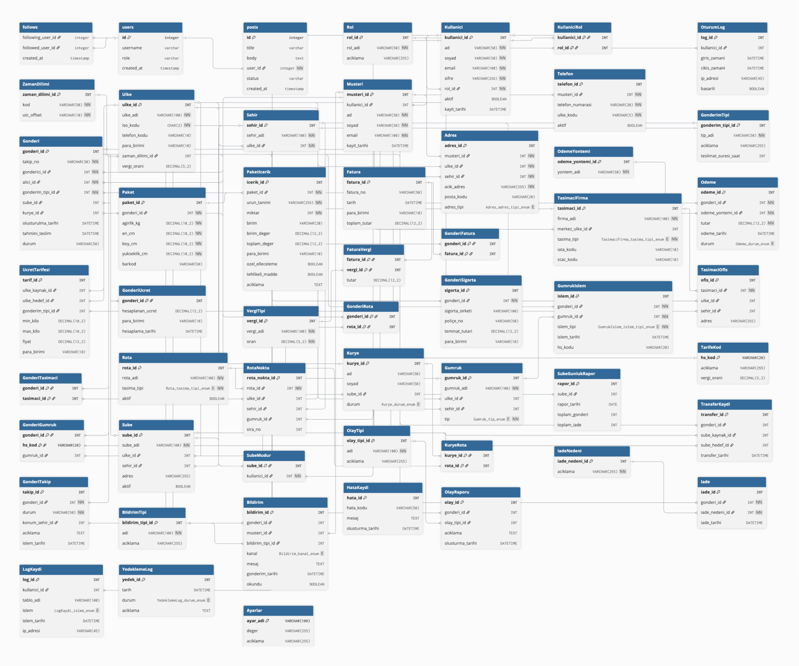

# Uluslararası Kargo — İlişkisel Veritabanı Tasarımı

[](https://www.mysql.com/)
[](LICENSE)

Uluslararası ölçekte bir kargo operasyonunu modelleyen **ilişkisel veritabanı şeması**, **varlık–ilişki (ER) diyagramı** ve **örnek DML/DDL betikleri**. Proje, Ege Üniversitesi Tire Kutsan Meslek Yüksekokulu **Veri Tabanı II** dersi kapsamında geliştirilmiştir; akademik teslimde kullanılan tablo tanımları ve örnek sorgular bu repoda **doğrudan çalıştırılabilir** MySQL 8 biçiminde sunulur.

## İçindekiler

- [ER diyagramı](#er-diyagramı)
- [Özellikler ve kapsam](#özellikler-ve-kapsam)
- [Teknoloji](#teknoloji)
- [Kurulum](#kurulum)
- [Proje yapısı](#proje-yapısı)
- [Veri modeli (özet)](#veri-modeli-özet)
- [Güvenlik ve üretim uyarısı](#güvenlik-ve-üretim-uyarısı)
- [Yazarlar ve danışman](#yazarlar-ve-danışman)
- [Lisans](#lisans)

## ER diyagramı

Şema; gönderi çekirdeği, coğrafya, kullanıcı ve müşteri yönetimi, rota ve personel, finans, gümrük ve üçüncü taraf taşıyıcılar, bildirim ve iz kayıtları gibi modüllerle normalize edilmiş yapıyı gösterir.



*(Yüksek çözünürlük için repoda `docs/er-diagram.png` dosyasına bakın.)*

## Özellikler ve kapsam

- 50+ tablo ile normalizasyonlu tasarım; çoktan çoğa ilişkiler için ara tablolar
- Birincil ve yabancı anahtarlar; DDL betiklerinde tablo oluşturma sırası uyumlu
- Örnek `INSERT` / `UPDATE` / `DELETE` ve çok tablolu `SELECT` örnekleri
- UTF-8 (`utf8mb4`) ile Türkçe karakter desteği

## Teknoloji

| Bileşen | Sürüm / not |
|---------|-------------|
| MySQL | **8.0+** (`Telefon` tablosundaki `CHECK ... REGEXP` için) |
| Karakter seti | `utf8mb4` / `utf8mb4_unicode_ci` |

## Kurulum

```bash
mysql -u root -p < sql/01_schema.sql
mysql -u root -p < sql/05_insert_sample_data.sql
```

Örnek sorgular:

```bash
mysql -u root -p uluslararasi_kargo < sql/02_select_single_table.sql
mysql -u root -p uluslararasi_kargo < sql/03_select_two_tables.sql
mysql -u root -p uluslararasi_kargo < sql/04_select_three_tables.sql
```

İsteğe bağlı (örnek veriyi değiştirir veya siler):

```bash
mysql -u root -p uluslararasi_kargo < sql/06_update_examples.sql
mysql -u root -p uluslararasi_kargo < sql/07_delete_examples.sql
```

## Proje yapısı

```
uluslararasi-kargo/
├── README.md
├── LICENSE
├── docs/
│   └── er-diagram.png       # ER diyagramı
├── VT2FinalTeslim.pdf      # Akademik teslim (isteğe bağlı; telif için danışman onayı önerilir)
└── sql/
    ├── 01_schema.sql
    ├── 02_select_single_table.sql
    ├── 03_select_two_tables.sql
    ├── 04_select_three_tables.sql
    ├── 05_insert_sample_data.sql
    ├── 06_update_examples.sql
    └── 07_delete_examples.sql
```

## Veri modeli (özet)

| Alan | Tablolar (örnek) |
|------|-------------------|
| Kimlik ve erişim | `Rol`, `Kullanici`, `KullaniciRol`, `OturumLog` |
| Coğrafya | `Ulke`, `Sehir`, `ZamanDilimi` |
| Müşteri | `Musteri`, `Adres`, `Telefon` |
| Gönderi | `GonderimTipi`, `Gonderi`, `Paket`, `PaketIcerik`, `GonderiTakip` |
| Finans | `Fatura`, `GonderiFatura`, `Odeme`, `OdemeYontemi`, `UcretTarifesi`, `GonderiUcret`, … |
| Operasyon | `Sube`, `Kurye`, `TransferKaydi`, `SubeGunlukRapor`, … |
| Uluslararası | `Gumruk`, `GumrukIslem`, `TarifeKod`, `TasimaciFirma`, `Rota`, … |
| Bildirim ve iz kaydı | `Bildirim`, `LogKaydi`, `YedeklemeLog`, … |

## Güvenlik ve üretim uyarısı

- Örnek kullanıcı şifreleri **yalnızca demo** içindir; üretimde hash (ör. `bcrypt` / `argon2`) kullanın.
- `07_delete_examples.sql` örnek veriyi kaldırır; canlı veritabanında çalıştırmayın.
- Kişisel erişim jetonlarını veya parolaları repoya veya commit mesajına eklemeyin.

## Yazarlar ve danışman

| Rol | İsim |
|-----|------|
| Grup üyesi | Kayra Demirkan |
| Grup üyesi | Samet Tokdemir |
| Danışman | Öğr. Gör. Yeşim Aktaş — Ege Üniversitesi, Tire Kutsan Meslek Yüksekokulu |

Telif bilgisi için bkz. [LICENSE](LICENSE).

## Lisans

Bu depodaki SQL, diyagram görseli ve dokümantasyon [MIT Lisansı](LICENSE) ile yayınlanmıştır (yazarların telif beyanı LICENSE dosyasındadır). Akademik teslim PDF’sinin herkese açık paylaşımı üniversite kurallarına tabidir.
